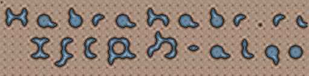

# expansion fast cell — Rounded Squares
algorithm

interactive source page for habr [article](https://habr.com/ru/articles/302756/)
that does "smooth"/auto tiles like this

with extreamly minimal "texture circle"
